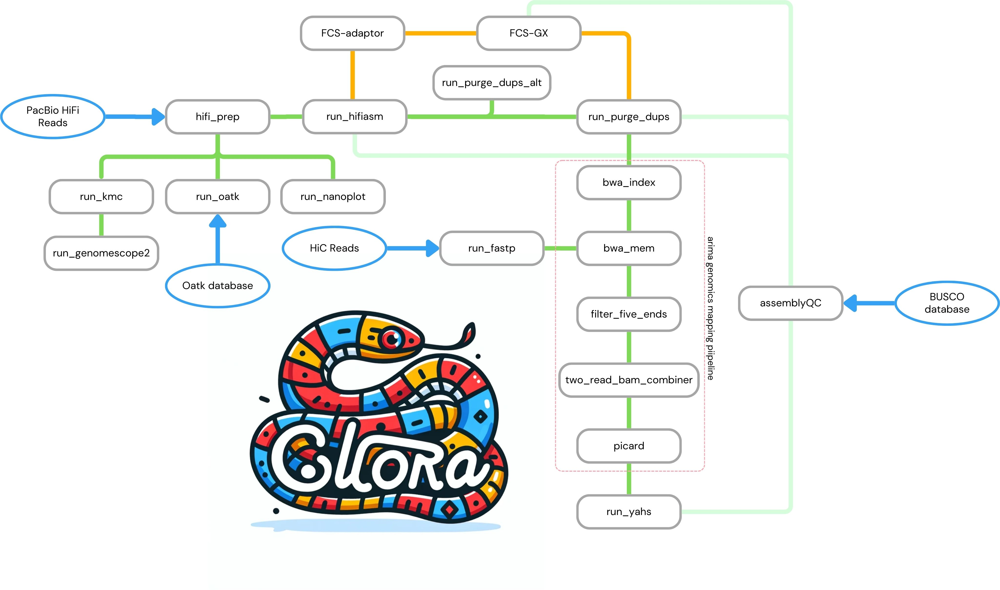

# Snakemake workflow: `colora`

[](https://snakemake.github.io)
[](https://github.com/LiaOb21/colora/actions?query=branch%3Amain+workflow%3ATests)


A Snakemake workflow for for genome assembly.


Input files: hifi reads, optionally ONT, and hic reads.

## Usage

The usage of this workflow is described in the [Snakemake Workflow Catalog](https://snakemake.github.io/snakemake-workflow-catalog/?usage=<LiaOb21>%2F<colora>).

If you use this workflow in a paper, don't forget to give credits to the authors by citing the URL of this (original) <colora> sitory and its DOI (see above).

- place raw hifi reads in /resources/raw_hifi
- place oatk database of interest from github.oatkdb.repo in /resources/oatkDB
- place raw hic reads in /resources/raw_hic


How to run `colora`:
```
snakemake --software-deployment-method conda --snakefile workflow/Snakefile --cores all

snakemake --software-deployment-method conda --snakefile workflow/Snakefile --cores all --dry-run


#for the cluster:

srun --cpus-per-task 100 --mem 200G -t 5-00 snakemake --software-deployment-method conda --conda-frontend mamba --snakefile workflow/Snakefile --cores 100
```

Before executing the command, ensure you have appropriately changed your `config.yaml`

Test the pipeline:

- 1. Download test data
- 2. Download oatk DB
- 3. Download FCS-GX test database
- 4. Run the test pipeline

```
snakemake --configfile config/config_test.yaml --software-deployment-method conda --snakefile workflow/Snakefile --cores all --dry-run
```

# TODO


* The workflow will occur in the snakemake-workflow-catalog once it has been made public. Then the link under "Usage" will point to the usage instructions if `<owner>` and `<repo>` were correctly set.

- [x] Rule for Nanoplot
- [x] Rule for fastp 
- [x] Rules for arima pipeline - split in several rules
- [x] Rule for yahs
- [x] integrate the snakemake report in the workflow: not necessary
- [x] input / output: hardcoded is okay
- [x] test dataset
- [x] test config file
- [x] test possibility to add ONT reads as optional param in hifiasm
- [ ] test possibility to add HiC reads as optional params in hifiasm: file names change in this case. Need more study. Probably this needs a separate rule.
- [ ] packages versions: create stable yaml files with conda export
- [ ] add singularity and docker as option for environment management (n.b. ncbi FCS can be run only with singularity)
- [ ] implement ncbi `FCS` (decontamination) as optional rule (orange path in the scheme above)
- [x] make purging steps optional 
- [ ] make decontamination optional
- [ ] slurm integration (profile)
- [ ] setting of resources for each rule
- [x] Rule `purge_dups.smk` and `purge_dups_alt.smk`: redirecting outputs to the final directory doesn't looks nice + in the root directory at the end of the workflow there are some files that I'm not sure why they are there
- [ ] implement `assemblyQC` - waiting for new Merqury release to make a new conda recipe (light green path above)
- [x] Formatting and linting to be fixed according to snakemake requirements
- [ ] log files: some of them are empty because it's impossible to redirect stderr and stdout to the file


Notes:
- purge dups rule wasn't working due to issues with the path where the output files are written.Evaluate possibility to change directory within the rule. Purge_dups rule wasn't working also because the command to convert the hifiasm gfa to fasta not interpreted correctly by snakemake. SOLVED


- Arima pipeline - changes compared to the original pipeline:
   - creating conda environments with needed tools so no need to specify tools' path
   - Remove the PREFIX line and the option -p $PREFIX from the bwa command, it is not necessary and creates problems in the reading of files
  - add -M flag in bwa mem command - step 1.A and 1.B
  - pipeline split in several rules


- Decontamination with FCS-GX using conda is impossible at the moment. The conda recipe is incomplete and it only allows to produce the report with the contaminants but it doesn't allow to remove the contaminants, i.e. there is not a `clean genome` option in `run_gx.py`, like in the docker/singularity version `fcs.py`. Opened an issue on github: https://github.com/ncbi/fcs/issues/74. The only way to implement this decontamination step is getting the authors to update the bioconda recipe or explain better how to use it. It's usage is substantially different from what explained in the wiki, and any attempt to understand the code is vane because it's like a box into a box into a box.